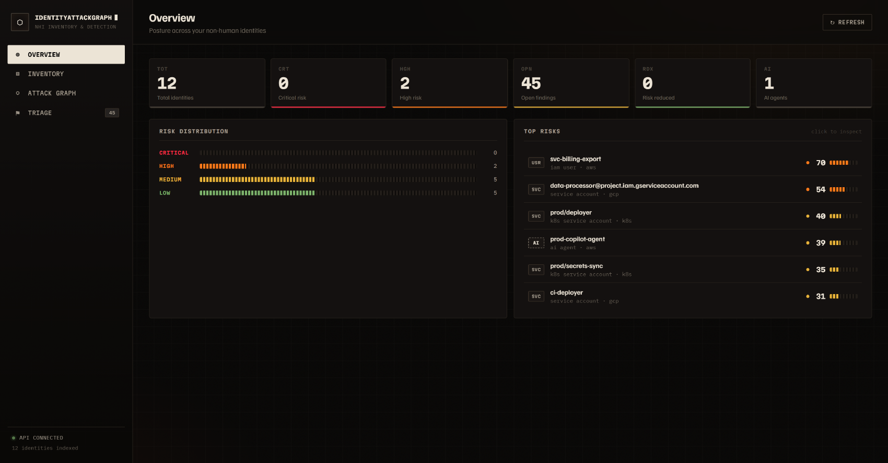
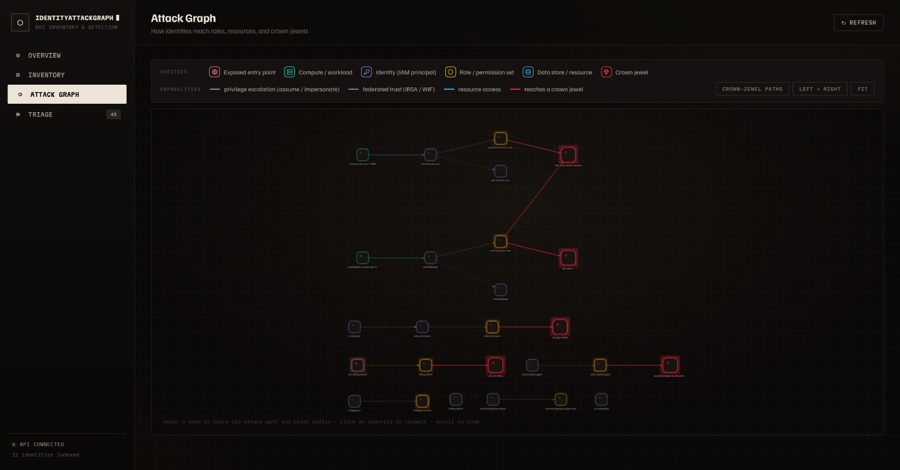
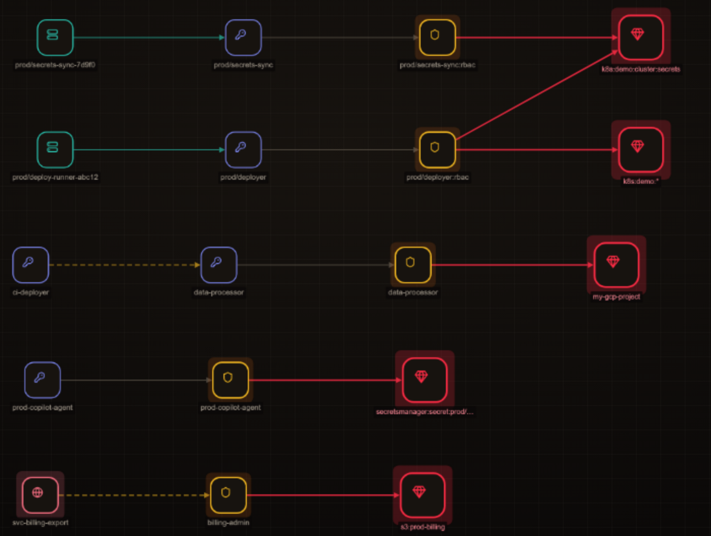
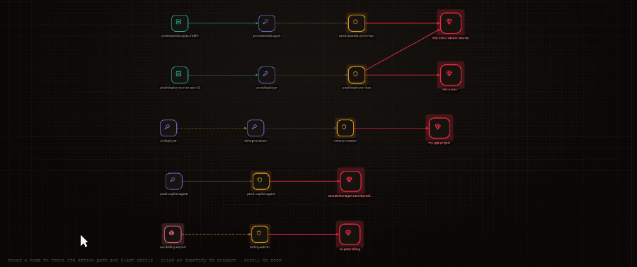
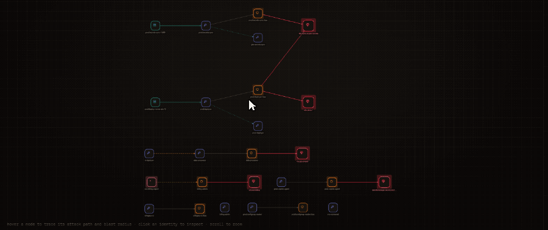
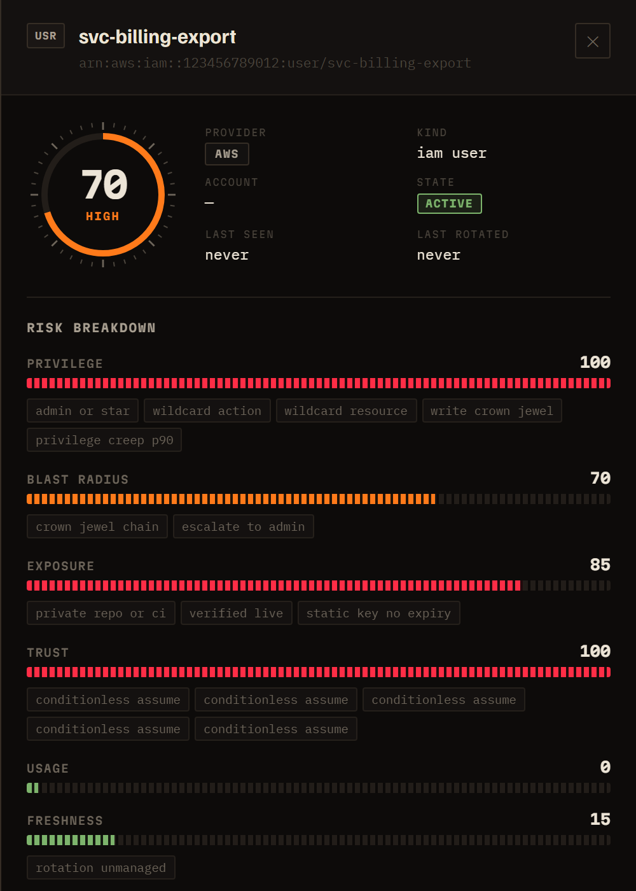
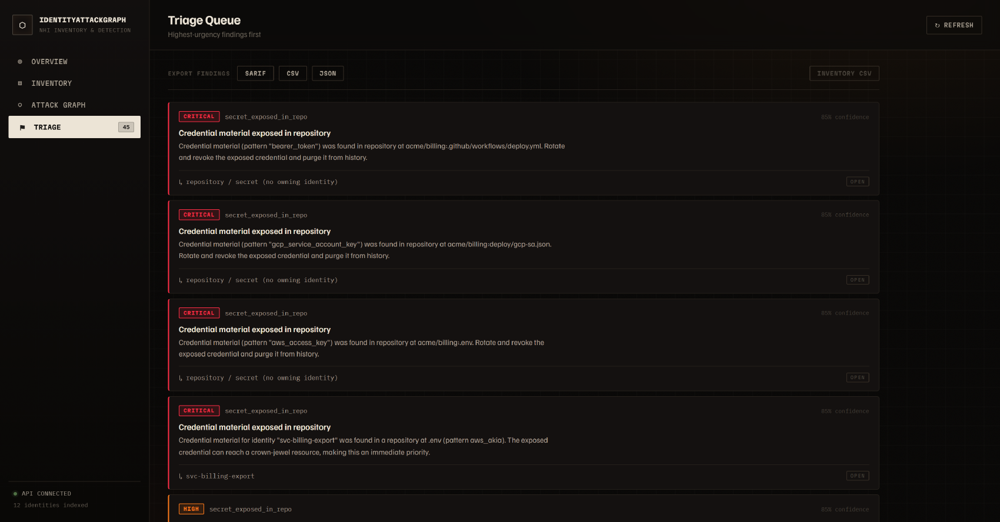

<div align="center">

# IdentityAttackGraph

### Non-Human Identity Inventory, Risk Scoring & Attack-Path Detection

**Discover, normalize, risk-score, and detect abuse of the machine identities that run modern cloud — service accounts, access keys, API tokens, workload identities, secrets, and AI-agent identities — across multi-account AWS, multi-project GCP, and Kubernetes, then walk the exact attack path from a leaked credential to a crown-jewel resource.**

[](https://github.com/utpalbalse/IdentityAttackGraph/actions/workflows/ci.yml)


[Quick start](#-quick-start-one-command) · [See it in action](#-see-it-in-action) · [Architecture](#-architecture) · [Detections](#-detection-engine) · [Docs](#-documentation)

<br/>



<sub>The Overview console: multi-cloud NHI inventory, risk distribution, and the risk-ranked top-risk queue.</sub>

</div>

---

## The problem

Human logins are a solved-ish problem — MFA, SSO, conditional access. **Non-human identities (NHIs) are not.** They now outnumber humans in the cloud 10–50×, they hold the privileges that actually reach production data, they rarely rotate, and they routinely federate across trust boundaries (a Kubernetes pod assuming an AWS role via IRSA; a CI service account impersonating a GCP owner). When one is over-privileged, leaked, or orphaned, the blast radius is enormous — and most tools inventory identities in flat lists that can't answer the only question that matters: **"if this one is compromised, what can the attacker actually reach, and how?"**

IdentityAttackGraph answers six questions across your entire multi-cloud estate:

| | Question | How it's answered |
|--|----------|-------------------|
| **1** | **What** machine identities exist? | Provider collectors → one normalized inventory |
| **2** | **Where** are they used (workloads, repos, resources)? | Workload + repo-exposure mapping |
| **3** | **Which** are over-privileged, stale, or orphaned? | 6-factor risk score + hygiene detectors |
| **4** | **Which** are behaving abnormally **right now**? | Statistical anomaly detection over usage |
| **5** | **What** is the **blast radius** if one is compromised? | In-memory attack-graph traversal |
| **6** | **What** to remediate first — and how much risk does it remove? | Ranked remediations with measurable risk delta |

> **Built from scratch — not a wrapper.** The inventory model, normalization, graph engine, risk scoring, attack-path reasoning, and every detector are original code. Cloud provider APIs are used for data collection only; there is no Semgrep/Wazuh/Suricata under the hood.

---

## ✨ See it in action

<div align="center">

</div>

The **attack-graph view** projects every capability edge as a hierarchical kill chain that reads left to right — **exposed entry point → identity → role → crown jewel**. Icon and hue classify the entity; the line tells you *how* the hop works:

| | Encoding |
|--|----------|
| 🌐 rose | Exposed entry point — an identity with live credential material in a repo |
| 🖥 teal | Compute / workload (pods, runners) |
| 🔑 indigo | Identity — IAM user, service account, AI agent |
| 🛡 amber | Role / permission set |
| 💎 red | Crown jewel — the asset you cannot lose |
| ┄┄ dashed | **Privilege escalation** (`sts:AssumeRole`, impersonation) |
| ⋯ dotted | **Federated trust** across a cloud boundary (IRSA / WIF) |
| ── red | The hop that **lands on a crown jewel** |

Filtering to **crown-jewel paths** collapses the estate to just what an attacker would actually walk — here, five distinct routes to a crown jewel across AWS, GCP, and Kubernetes:

<div align="center">

</div>

### Trace a path, or a blast radius — on hover

Hovering any node runs a live directed traversal: **upstream** (in rose) is every route an attacker could take to *reach* it; **downstream** (in amber) is everything that falls if it is compromised. Everything unrelated dims away.

<table>
<tr>
<td width="50%" align="center"></td>
<td width="50%" align="center"></td>
</tr>
<tr>
<td align="center"><sub><b>Attack path</b> — a leaked key is 2 hops from a crown jewel<br/><code>0 upstream · 2 downstream</code></sub></td>
<td align="center"><sub><b>Blast radius</b> — one pod identity reaches 2 crown jewels<br/><code>1 upstream · 4 downstream</code></sub></td>
</tr>
</table>

One command seeds a synthetic multi-cloud environment with the exact mistakes attackers exploit, runs the full pipeline, and narrates the worst paths it finds — each with the detections that caught it and the single remediation that severs it:

```text
━━━ Scenario 1 · Leaked credential → crown jewel
  target  svc-billing-export  (risk 70)
  RECON   attacker finds credential material at .env:12 (pattern aws_akia) — belongs to svc-billing-export
  STEP 0  ▸ svc-billing-export [identity]
  STEP 1  → assumes role billing-admin [role] ▲ high
  STEP 2  → gains access to arn:aws:s3:::prod-billing [resource] ◆ CROWN JEWEL
  IMPACT  1 crown jewel reachable · nearest crown jewel 2 hops · reaches admin: true
  CAUGHT  secret_exposed_in_repo (critical), suspicious_role_chain (high),
          conditionless_assume_role (high), high_blast_radius (high), …
  FIX     reduce_scope  →  risk 70 → 33  (−37)

━━━ Scenario 2 · Over-scoped AI agent
  target  prod-copilot-agent  (risk 39)
  AGENT   framework=langchain model=gpt-4o ttl=720h broad_scope=true uncontrolled_tools=true
  STEP 2  → gains access to arn:aws:secretsmanager:…:secret:prod/app/master ◆ CROWN JEWEL
  CAUGHT  ai_agent_overscoped (high), high_blast_radius (high), over_privileged_sa (high)
  FIX     reduce_scope  →  risk 39 → 2  (−37)
```

Everything above is computed **live from the graph** — the path, the detections, and the risk delta. Full output and machine-readable/SARIF samples: [`docs/DEMO.md`](docs/DEMO.md) · [`docs/samples/`](docs/samples/).

Every score is **explainable** — a transparent weighted sum of six factors with per-factor evidence, never a black box:

<div align="center">

</div>

---

## 🏗 Architecture

```
                    ┌──────────── COLLECTORS (normalize → unified model) ────────────┐
   AWS  ──────────► IAM · STS · CloudTrail · Secrets Manager   (assume-role + ExternalId)
   GCP  ──────────► service accounts · keys · impersonation/WIF · Cloud Audit Logs
   K8s  ──────────► ServiceAccounts · RBAC · pods · IRSA/Workload-Identity   (live client-go OR export)
   Repos ─────────► built-in secret scanner (entropy) OR SecretSweep report ingest
                    └───────────────────────────────┬────────────────────────────────┘
                                                     │  deterministic UUIDv5 → idempotent, cross-collector reconciliation
                                                     ▼
                                        PostgreSQL 16  (system of record)
                                                     │
                                        graph projection (nodes + capability edges)
                                                     │
        ┌────────────────────────────────────────────┼────────────────────────────────────────────┐
        ▼                                             ▼                                             ▼
   RISK ENGINE                               DETECTION ENGINE                              GRAPH ENGINE
   6 explainable factors                     17 detectors (rule + anomaly)                 in-memory DAG, BFS/DFS
   hot-reloadable weights                    evidence + narrative + dedupe                 blast radius + attack paths
        └────────────────────────────────────────────┼────────────────────────────────────────────┘
                                                     ▼
                        REST + GraphQL API  ·  React/Cytoscape UI  ·  Slack/webhook alerts  ·  SARIF/JSON/CSV export
                        NATS JetStream queue  ·  Redis rate limit  ·  Prometheus metrics  ·  OpenTelemetry traces
```

The **attack graph** is a from-scratch directed property graph (no Neo4j) whose edges are *capabilities* — `assumes`, `impersonates`, `federated_from`, `binds_to`, `has_permissions`, `uses`. Because every identity gets a **deterministic UUIDv5** derived from its provider identity, a Kubernetes ServiceAccount's IRSA annotation reconciles onto the *exact* AWS IAM role node — producing a single **pod → cloud role → crown-jewel** path across cloud boundaries, regardless of which collector ran first.

---

## 🔎 Capabilities

<table>
<tr><td width="50%" valign="top">

**Collection (multi-cloud, least-privilege)**
- **AWS** — IAM users/roles, access keys + last-used, assume-role trust, Secrets Manager inventory, CloudTrail usage
- **GCP** — service accounts, keys, impersonation / Workload Identity Federation, project IAM, Cloud Audit Logs
- **Kubernetes** — ServiceAccounts, effective RBAC, pods, token secrets, IRSA/WIF federation — from a **live cluster (client-go)** or a `kubectl` export
- **Repositories** — built-in secret scanner (curated patterns + Shannon entropy) or SecretSweep report ingest
- Cross-account via **assume-role + ExternalId**; in-cluster via **IRSA** — no long-lived target credentials stored

</td><td width="50%" valign="top">

**Analysis & response**
- **6-factor explainable risk** — privilege · blast-radius · exposure · trust · usage · freshness; tunable, hot-reloadable weights; per-factor evidence
- **17 detectors** — 10 rule + 7 statistical anomaly, each with evidence, an attack narrative, and a stable fingerprint
- **Attack-path & blast-radius** traversal to crown jewels / admin
- **Triage + remediation** with measurable **risk-delta** tracking
- **Alerting** — Slack / generic webhook, severity threshold, at-least-once
- **Exports** — SARIF 2.1.0 (GitHub code scanning), JSON, CSV

</td></tr>
<tr><td valign="top">

**API & UX**
- **REST** + **GraphQL** (`/api/v1/graphql`) read surface
- **RBAC** — bearer token or **OIDC JWT with JWKS auto-fetch** (keys cached by `kid`, refreshed on rotation); viewer / analyst / admin
- Audited mutations, admin-gated suppressions, snapshots
- **React + TypeScript + Cytoscape** attack-graph dashboard

</td><td valign="top">

**Platform & operations**
- **One-command** Docker Compose local stack
- **Helm chart** (api/worker/web, migration hook, IRSA SA, Ingress, HPA/PDB, ServiceMonitor)
- **Terraform** for EKS/RDS/ElastiCache + least-priv cross-account collector roles
- **Prometheus** metrics + **OpenTelemetry** traces; secret-redacting logs
- **NATS JetStream** work queue; **Redis** rate limiting
- CI (build/vet/test/gofmt/**govulncheck**) + **k6** load test

</td></tr>
</table>

---

## 🚀 Quick start (one command)

No local Go or Node toolchain required — everything builds and runs in containers.

```bash
make dev      # compose up: postgres, redis, nats, migrate, api, worker, web
make demo     # seed AWS+GCP+K8s fixtures, run the pipeline, print the attack simulation
open http://localhost:5173
```

Point it at real clouds — same pipeline, same graph, same detections:

```bash
collector --provider aws --role-arn <arn> --external-id <id>            # docs/AWS_COLLECTOR.md
collector --provider gcp --project <project-id>                        # docs/GCP_COLLECTOR.md
collector --provider k8s --cluster prod --kubeconfig ~/.kube/config    # or --k8s-export cluster.json
collector --provider repo --scan-path ./checkout --repo acme/api      # or --report secretsweep.json
```

---

## 🧠 Detection engine

Every detection is **custom-built, explainable, and evidenced** — a stable detector id, severity, structured evidence, an attacker-framed narrative, and a fingerprint for dedupe. Detectors are **rule-based** (deterministic over current state) or **anomaly-based** (statistical over usage history with per-identity + peer baselines).

The **triage queue** ranks every open finding by severity then confidence, and exports to SARIF, CSV, or JSON for your existing pipeline. Findings with no owning identity (a secret in a repo, an unused vault entry) are first-class — they are the ones most tools drop:

<div align="center">

</div>

<details>
<summary><b>All 17 detectors</b></summary>

| Detector | Type | Catches |
|----------|------|---------|
| `orphaned_identity` | rule | Active identity with no owner, workload, or repo reference |
| `stale_identity` | rule | No legitimate usage within the staleness window |
| `stale_access_key` | rule | Unused, rotation-overdue, or past max-age credential |
| `over_privileged_sa` | rule | Admin / `*:*` / privilege-escalation / crown-jewel write |
| `conditionless_assume_role` | rule | Assume-role trust with no ExternalId/MFA/IP guard |
| `wildcard_trust` | rule | Trust policy principal is `*` or external |
| `secret_exposed_in_repo` | rule | Credential material found in a repository (location + fingerprint only) |
| `high_blast_radius` | rule | Reaches a crown jewel or escalates to admin via the graph |
| `ai_agent_overscoped` | rule | AI agent with broad scope / long TTL / uncontrolled tools |
| `unused_secret` | rule | Managed secret with no references and no recent access |
| `impossible_travel` | anomaly | Two events implying travel faster than physically possible |
| `unusual_geo` | anomaly | First use from a new country vs. baseline |
| `new_asn_or_runtime` | anomaly | Access from an unrecognized ASN / runtime |
| `usage_spike` | anomaly | Event volume exceeds `mean + Nσ` of the hourly baseline |
| `first_use_sensitive_action` | anomaly | First-ever invocation of a sensitive action (the intrusion pivot) |
| `privilege_creep` | anomaly | Permission count exceeds the identity's history or peer-group P90 |
| `suspicious_role_chain` | anomaly | Multi-hop assume/impersonate/federate chain to higher privilege |

**False-positive controls:** anomaly warm-up, egress/VPN CIDR allowlist, break-glass identities, ≥2-signal corroboration, admin-gated audited suppressions, fingerprint dedupe, and confidence scoring. See [`docs/DETECTIONS.md`](docs/DETECTIONS.md).

</details>

---

## 🛡 Security engineering

- **No secret material is ever stored, logged, or returned.** Exposures carry *location + fingerprint* only; the log handler scrubs credential-shaped values; Secrets Manager metadata is read without ever calling `GetSecretValue`.
- **Least-privilege, no-static-credential collection** — cross-account via `sts:AssumeRole` + `ExternalId` (confused-deputy guard), in-cluster via IRSA/Workload Identity. The exact read-only IAM policy is documented and codified in Terraform.
- **Explainable by design** — the risk score is a transparent weighted sum with per-factor evidence, not a black-box model, so an analyst can see *why* an identity scored 78.
- **Idempotent & replay-safe** — deterministic UUIDv5 identity ids make every collector re-run a no-op and let trust edges cross-reference principals before they're persisted.
- See [`docs/THREAT_MODEL.md`](docs/THREAT_MODEL.md).

---

## 🧪 Quality

- **Unit-tested** across the risk engine, every detector, the graph traversal, all four collectors (AWS policy analysis, GCP roles, the K8s normalizer + **fake-clientset** live source, the repo scanner), JWKS validation (via a real `httptest` OIDC server), and the GraphQL schema (in-memory data source).
- **CI** on every push: `go build` · `go vet` · `go test` · `gofmt` · `govulncheck`.
- **Load-tested** with a k6 script enforcing p95/p99 latency + error-rate SLOs.
- **~13k lines of Go**, 6 SQL migrations, zero secret material in the data model.

---

## 🧰 Tech stack

**Backend** Go 1.26 · pgx · chi · PostgreSQL 16 (partitioned `usage_events`, `pg_trgm` search, recursive CTEs)
**APIs** REST (chi) · GraphQL (graphql-go) · SARIF 2.1.0
**Async & cache** NATS JetStream · Redis
**Observability** Prometheus · OpenTelemetry (OTLP)
**Frontend** React · TypeScript · Vite · Cytoscape
**Cloud SDKs** AWS SDK for Go v2 · Google Cloud SDKs · Kubernetes client-go
**Deploy** Docker Compose · Helm · Terraform (EKS/RDS/ElastiCache/IRSA) · GitHub Actions

---

## 📚 Documentation

| Doc | What's in it |
|-----|--------------|
| [DEMO.md](docs/DEMO.md) | **Start here** — one-command demo + narrated attack path |
| [ARCHITECTURE.md](docs/ARCHITECTURE.md) | Component design, data flow, deployment topology |
| [THREAT_MODEL.md](docs/THREAT_MODEL.md) | Assets, threats, trust boundaries, mitigations |
| [DATA_MODEL.md](docs/DATA_MODEL.md) | Unified schema, entities, graph model |
| [RISK_MODEL.md](docs/RISK_MODEL.md) | Scoring formula, factor weights, rationale |
| [DETECTIONS.md](docs/DETECTIONS.md) | Every detector, its logic, evidence shape, FP controls |
| [API.md](docs/API.md) · [AUTH.md](docs/AUTH.md) | REST + GraphQL surface · RBAC / OIDC-JWKS |
| [AWS_COLLECTOR.md](docs/AWS_COLLECTOR.md) · [GCP_COLLECTOR.md](docs/GCP_COLLECTOR.md) · [K8S_COLLECTOR.md](docs/K8S_COLLECTOR.md) · [REPO_SCANNER.md](docs/REPO_SCANNER.md) | Per-collector detail + least-priv policy |
| [ALERTING.md](docs/ALERTING.md) · [RUNBOOK.md](docs/RUNBOOK.md) · [ROADMAP.md](docs/ROADMAP.md) | Alerting · operations · milestone plan |

---

## 🗺 Repository layout

```
cmd/         entrypoints: api · worker · collector · migrate · simulate
internal/    engine: models · store · graph · risk · detect · collectors · api · graphqlapi · auth · notify · tracing
migrations/  versioned SQL schema (partitioning, pg_trgm, recursive CTEs)
web/         React + TypeScript + Cytoscape dashboard
deploy/      docker-compose · Dockerfiles · helm · terraform · loadtest
docs/        design docs + committed sample reports
```

## Status

Phases 0–6 complete: discovery → graph → risk → detection → triage/remediation → export, plus production deploy (Helm/Terraform), observability (Prometheus + OTel), RBAC/OIDC, alerting, GraphQL, and a narrated attack-path demo. See [ROADMAP.md](docs/ROADMAP.md).

## License

[Apache-2.0](LICENSE).
